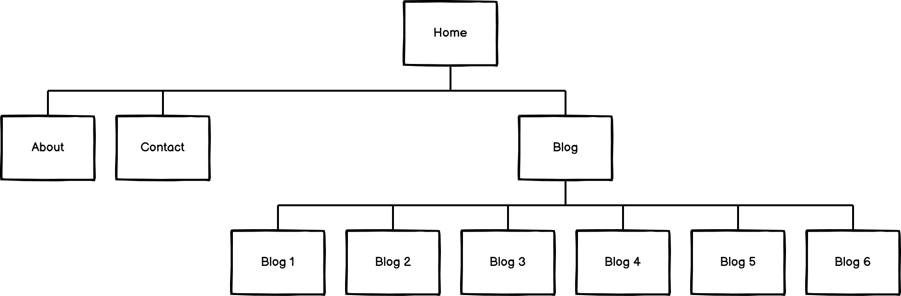
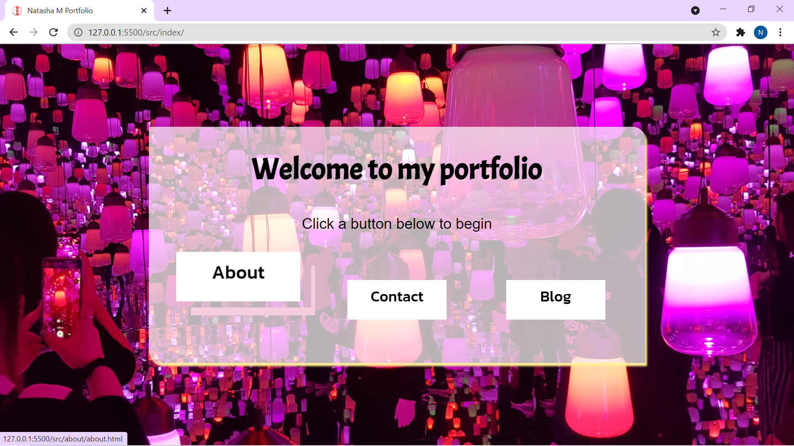
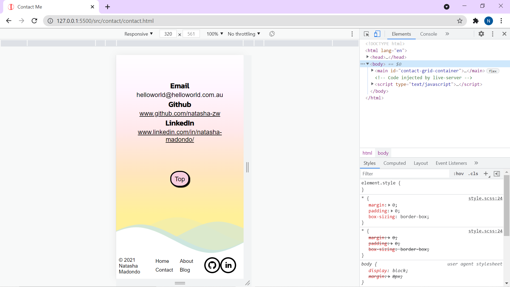
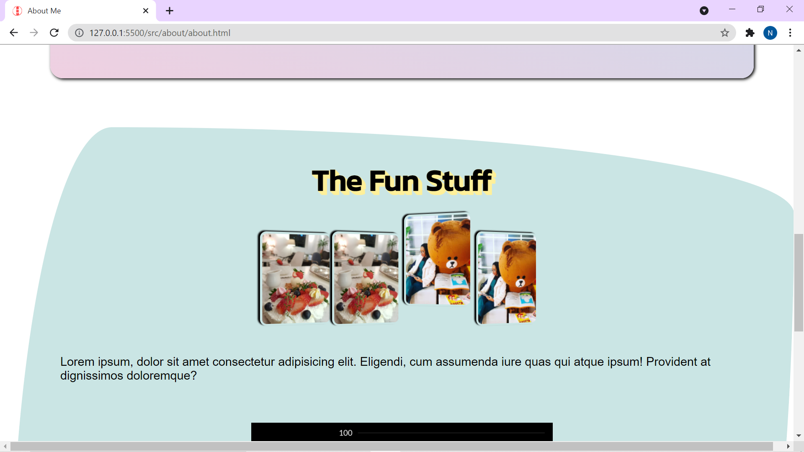

# T1A2 Portfolio 

### Purpose
The purpose of this site is to showcase me as an IT professional and a web developer to potential employers. It is targeted to potential employers and other IT professionals.

### Site Features

The site features;
* a blog that will showcase my current and future projects,
* a link to a pdf of my resume,
* a contact me page with my contact information, 
* an about me page with information about my work experience, education and hobbies, 
* hover elements for the user to engage with 
* parallax svg elements were used to add to the overall aesthetic,
* and photography that was shot by me.

### Sitemap

## Screenshots

#### Splash Page with hover effect 

#### Parallax effect on contact page shown in mobile view 

#### Hover effect on about page image component 

## Tech Stack 
The tech stack used for this site were HTML and SCSS. The site was deployed on netlify and linked to github.  
